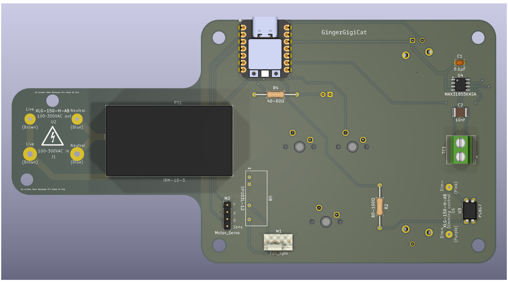
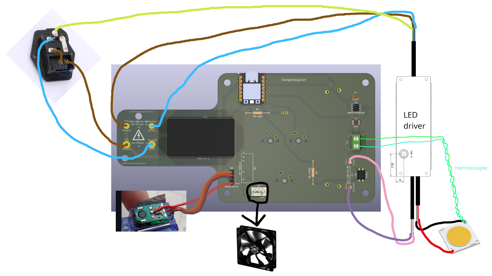

# This is my followspot i've designed for [highway](https://highway.hackclub.com/)!

It has:

- An over 100W white LED COB chip for over 17000 lumens of light output (Max. 150W, real max depends on how much heat the led dissipates as i'll have to limit it so it can't overheat and die)
- An upcycled camera lens not good enough for photography but perfect for a beam of light
- Motorised lens control with manual control if desired and zoom recall
- Digital constant current LED dimming (so no flickering from PWM)
- USB-C for computer control of brightness and zoom
- Fully open source everything
- 3 programmable buttons and a fader
- Automatic brightness reduction if the LED gets too hot
- An LED on the control panel to give feedback, like if the LED is too hot or the lens is being pushed too far

The body is 3D printed but it could be made out of a better material if you feel like it, and the legs are plywood, and of course the lens is glass.

Here's the onshape link! https://cad.onshape.com/documents/9e98bdcd2562c04de815ecc5/w/89c7868c82d5394c068b4491/e/8808e6d7c01ac629712aeab9?renderMode=0&uiState=6882b614a27d1511c88b3256

## Why?

I wanted my GCSE Design and Technology project to be a spotlight, but my DT teacher said no and told me to downsize it to a desk lamp. It got me a good grade, but it's not what I wanted to make, so I'm taking the opportunity to make what I want to make, with an LED bright enough to blind my DT teacher! (/j....) I'm going to take inspiration from my project, as I do like the general hexagonal design of it (see below)

I have a passion for the technical parts of theatre, so making this was rather an obvious choice for me

## PCB

## Wiring Diagram

(Made in GIMP :))

## More pictures :)

